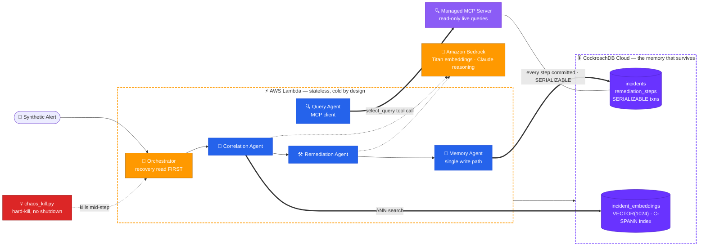

# Continuum

<p align="center">
  
</p>

<p align="center">
  <strong>An autonomous incident-response agent that resumes the exact step it was killed on — because its memory lives in CockroachDB, not in the process.</strong>
</p>

> **CockroachDB × AWS Hackathon 2026 — Build with Agentic Memory**

[](https://github.com/iarjunganesh/continuum/actions/workflows/ci.yml)
[](https://codecov.io/gh/iarjunganesh/continuum)
[](https://github.com/iarjunganesh/continuum/releases/latest)
[](LICENSE) [](#live-demo)

[](https://cockroachlabs.cloud/mcp)
[](https://www.cockroachlabs.com/docs/stable/vector-indexes)
[](https://aws.amazon.com/bedrock/)
[](https://aws.amazon.com/lambda/)

[](https://gradio.app/)
[](https://huggingface.co/spaces/iarjunganesh/continuum)

[](https://www.python.org/)
[](https://fastapi.tiangolo.com/)
[](https://www.psycopg.org/psycopg3/)

---

## What Is This?

Most "agent memory" demos store chat history. Continuum stores something that matters under pressure: **which remediation step is executing right now, which alert correlates with which past incident, and the exact state of recovery the instant before something crashes.**

The conditions that cause production incidents — resource exhaustion, node failure, deploy rollbacks — are exactly the conditions that kill the agent responding to them. Continuum's design constraint:

> **The agent's execution environment is allowed to die mid-incident. Its memory is not.**

Every state transition is committed to **CockroachDB** before and after it happens. Kill the process mid-step — no graceful shutdown, no checkpoint call — and the next cold invocation reads the durable state, sees a step frozen in `executing`, and resumes *that exact step*. No lost context, no duplicated work, no human re-input.

**All incident and alert data is synthetic.** No real production systems, credentials, or customer data.

---

## How It Works

1. A **synthetic alert** fires (latency spike, error-rate breach, connection saturation)
2. The **Orchestrator** (AWS Lambda) starts cold — its *first action, always*, is a CockroachDB recovery read for open incident state matching this alert
3. The **Correlation Agent** embeds the alert via **Amazon Bedrock** (Titan v2, 1024-dim) and queries CockroachDB's **C-SPANN vector index** for semantically similar past incidents — structured filters and semantic ranking in one SQL round trip
4. The **Remediation Agent** reasons over the matched precedent (Claude on Bedrock) and proposes the next step
5. The **Memory Agent** — the *only* module allowed to write state — commits each step in explicit `SERIALIZABLE` transactions: the proposed action and `executing` status together (a forward step is claimed exactly once, `ON CONFLICT DO NOTHING`), then `executed`, with `resolved` committed atomically alongside the final step
6. **`chaos_kill.py`** hard-kills the process mid-execution; the step stays durably `executing` in CockroachDB — the fingerprint the next invocation resumes from
7. The **Query Agent** answers live questions through the **CockroachDB Cloud Managed MCP Server** — *"show me all open incidents and their current remediation step"* — from `GET /api/v1/incidents/open` and the Gradio UI's "Ask via MCP" button, not just from a human typing into Claude Code

---

## Architecture



Full spec: [`docs/ARCHITECTURE.md`](docs/ARCHITECTURE.md)

---

## CockroachDB Tools Used — and what the agent actually does with them

Two tools, both load-bearing in the running application (see ADR 004's resolution on why that's two done well rather than three done thin):

- **Distributed Vector Indexing** — `incident_embeddings.embedding VECTOR(1024)` with a C-SPANN index prefixed by `service`, so ANN search partitions per-service. The Correlation Agent's live query filters by structured columns *and* ranks by `<->` distance in one round trip. See [`infra/schema.sql`](infra/schema.sql).
- **CockroachDB Cloud Managed MCP Server** — read-only mode; `agents/query_agent.py` is a real MCP client (official `mcp` SDK, streamable HTTP) that the app itself calls from `GET /api/v1/incidents/open` and the Gradio UI's "Ask via MCP" button — not only a Claude Code/Cursor development convenience. The server's audit log doubles as a trail of what the agent looked at.

## AWS Services Used

- **AWS Lambda** — orchestrator execution; deliberately **no provisioned concurrency**, so every invocation proves state comes from CockroachDB, not warm process memory (ADR 002)
- **Amazon Bedrock** — Titan Text Embeddings V2 for alert→vector; Claude for remediation reasoning over matched precedent (with a deterministic precedent-replay fallback so the control flow demos even when throttled)

Judging-criteria mapping and full submission narrative: [`docs/DEVPOST.md`](docs/DEVPOST.md)

---

## Tech Stack

| Layer | Technology | Role |
| --- | --- | --- |
| **Memory** | [](https://cockroachlabs.cloud) | Transactional incident state + vector embeddings, one store |
| **LLM / Embeddings** | [](https://aws.amazon.com/bedrock/) | Titan v2 embeddings · Claude reasoning |
| **Compute** | [](https://aws.amazon.com/lambda/) | Stateless orchestrator, cold by design (SAM: [`infra/template.yaml`](infra/template.yaml)) |
| **Agents** | [](https://www.python.org/) [](https://www.psycopg.org/psycopg3/) | Orchestrator · Correlation · Memory · Remediation |
| **API** | [](https://fastapi.tiangolo.com/) | Versioned gateway (`/api/v1`) around the orchestrator |
| **Demo UI** | [](https://gradio.app/) [](https://huggingface.co/spaces/iarjunganesh/continuum) | Live incident console with recovery-timeline replay, reading straight from CockroachDB |
| **Observability** | [](https://www.structlog.org/) | Structured event logging across every agent |
| **Quality** | [](https://docs.astral.sh/ruff/) [](https://pytest.org) | CI gate + Codecov |

---

## Quick Start

```bash
# 1. Clone
git clone https://github.com/iarjunganesh/continuum.git
cd continuum

# 2. Configure (CockroachDB Cloud free tier + AWS credentials)
cp .env.example .env    # fill in COCKROACH_DATABASE_URL + AWS keys

# 3. Install (requires Python 3.14)
make install

# 4. Apply schema + seed synthetic incident history (with embeddings)
make migrate
make seed-data

# 5. Run the API + demo UI
make run-api
make run-ui

# 6. The resilience demo — kills the agent mid-step, proves recovery
make chaos-demo
```

On Windows (no `make`), use the PowerShell equivalents:

```powershell
.\scripts\migrate_and_seed.ps1   # step 4 — schema + synthetic seed data
.\scripts\chaos_demo.ps1         # step 6 — the resilience demo
```

The API is versioned under `/api/v1` — e.g. `GET /api/v1/health`, `POST /api/v1/alert` — so the wire contract can evolve without breaking the Gradio UI or demo scripts.

---

## Project Structure

```text
continuum/
├── agents/
│   ├── orchestrator.py        # Lambda entrypoint — recovery read FIRST, one step per invocation
│   ├── correlation_agent.py   # Bedrock Titan embeddings + CockroachDB vector search
│   ├── memory_agent.py        # THE single write path to incidents/remediation_steps
│   ├── remediation_agent.py   # Claude-on-Bedrock reasoning + precedent-replay fallback
│   └── query_agent.py         # CockroachDB Managed MCP Server client (read-only live queries)
├── api/main.py                # FastAPI gateway, versioned under /api/v1
├── infra/
│   ├── schema.sql             # incidents · remediation_steps · incident_embeddings VECTOR(1024)
│   ├── lambda_handler.py      # Lambda package entrypoint
│   └── template.yaml          # AWS SAM — deliberately NO provisioned concurrency (ADR 002)
├── scripts/
│   ├── generate_synthetic_incidents.py   # corpus incl. historical remediation paths
│   ├── seed_memory.py         # loads incidents + step history + embeddings
│   ├── chaos_kill.py          # cross-platform hard kill (psutil) — the demo beat
│   ├── chaos_demo.ps1         # Windows kill-and-recover sequence
│   └── demo_run.py            # drives one remediation step per --tick
├── ui/app.py                  # Gradio — live incident console + recovery-timeline replay
├── tests/
│   ├── unit/                  # recovery-semantics tests (all I/O mocked)
│   └── integration/           # full kill-and-recover cycle vs a real cluster
├── observability/structured_logger.py
├── docs/
│   ├── ARCHITECTURE.md · DEMO_RUNBOOK.md · SUBMISSION.md · DEVPOST.md · DEPLOY.md · BENCHMARKS.md
│   └── adr/                   # 9 Architecture Decision Records
└── .github/workflows/         # ci.yml (lint → test → coverage → Codecov) · release.yml · sync-to-hf-space.yml
```

---

## Architecture Decision Records

| ADR | Decision |
| --- | --- |
| [001](docs/adr/001-dual-memory-model.md) | Dual transactional + vector memory in one CockroachDB store — no separate vector DB to drift |
| [002](docs/adr/002-stateless-lambda-recovery.md) | Stateless Lambda, no provisioned concurrency — every invocation must recover cold |
| [003](docs/adr/003-mcp-readonly-queries.md) | MCP Server in read-only mode as the live query interface |
| [004](docs/adr/004-ccloud-cli-audit-role.md) | ccloud CLI evaluated, then cut — 2 tools done well beats 3 done thin |
| [005](docs/adr/005-synthetic-incident-data.md) | Synthetic incident corpus only — no real infra, ever |
| [006](docs/adr/006-scope-cuts.md) | Explicit scope cuts, documented instead of hidden |
| [007](docs/adr/007-eu-central-1-region.md) | eu-central-1 deployment region, kept in sync across config/template/ADR |
| [008](docs/adr/008-bedrock-region-split.md) | Bedrock calls target a separate region (`BEDROCK_REGION`, default eu-north-1) from the Lambda/CockroachDB region — this account's Bedrock quota is a dynamic account-level clamp that probes as ~0 across all regions and models (addendum); the app degrades to deterministic fallbacks |
| [009](docs/adr/009-step-execution-semantics.md) | Each step runs in two explicit `SERIALIZABLE` transactions with a forward-step claim (`ON CONFLICT DO NOTHING`) for exactly-once; correlation/Bedrock is best-effort, off the recovery critical path |

---

## Synthetic Demo Data

40 resolved historical incidents across 5 fictional services (`checkout-api`, `auth-service`, `recommendation-engine`, `search-index`, `billing-worker`), each seeded with its **actual remediation path** (e.g. `drain_connection_pool → restart_connection_pool → verify_connections_healthy`) — so when a live alert correlates with a precedent, the Remediation Agent has real steps to replay, not just a summary. Regenerate anytime:

```bash
python scripts/generate_synthetic_incidents.py --out data/synthetic/incidents_seed.jsonl --count 40
```

**Seeding without Bedrock.** `make seed-data` embeds each incident via Titan, but
this account's Bedrock quota is throttled (ADR 008). To populate the console/Space
with **no AWS dependency**, use deterministic vectors — `make seed-data-offline`
(or `.\scripts\migrate_and_seed.ps1 -Offline`). For honest, semantically-ranked
vectors without a per-run Bedrock call, capture them once where Bedrock is
reachable (`python scripts/capture_seed_embeddings.py`) and seed with
`python scripts/seed_memory.py --file … --from-fixture data/synthetic/seed_embeddings.json`.

---

## CI / CD

```text
push → ruff lint → ephemeral single-node CockroachDB → schema apply → pytest (46 unit + 3 integration) → coverage (≥90% gate, 100% measured) → Codecov
push to main → auto-sync to Hugging Face Space (public demo)
tag v*.*.* → GitHub Release, notes pulled from CHANGELOG.md
```

See [`.github/workflows/ci.yml`](.github/workflows/ci.yml), [`.github/workflows/release.yml`](.github/workflows/release.yml), and [`docs/DEPLOY.md`](docs/DEPLOY.md). The unit suite (46 tests, one file per agent/module, 100% measured coverage against a 90% CI gate) pins the properties the demo depends on: recovery read happens before any write, each step commits inside an explicit `SERIALIZABLE` transaction, interrupted steps are re-executed (never skipped, never duplicated), a forward step is claimed exactly once under concurrent invocations, and incidents resolve atomically with the final step. [`tests/integration/test_recovery_e2e.py`](tests/integration/test_recovery_e2e.py) drives that same resume-and-exactly-once contract against the real schema on a real CockroachDB instance CI spins up — not just against mocks — and [`tests/integration/test_chaos_kill_e2e.py`](tests/integration/test_chaos_kill_e2e.py) goes one step further: it spawns the orchestrator as a real subprocess and hard-kills it mid-step with [`scripts/chaos_kill.py`](scripts/chaos_kill.py) (a real `SIGKILL`/`TerminateProcess`, no graceful shutdown), then asserts a cold restart resumes the interrupted step exactly once from CockroachDB. The same script drives the literal process-kill beat live in the demo.

---

## Benchmarks

Latency of the CockroachDB memory operations the recovery guarantee depends on —
recovery read, per-step transaction commits, vector search, and the full
cold-resume path. Reproducible on any cluster with `make benchmark` (no Bedrock
needed — it uses deterministic vectors). Full table + methodology:
[`docs/BENCHMARKS.md`](docs/BENCHMARKS.md).

---

## Live Demo

| | |
| --- | --- |
| **App** | [https://huggingface.co/spaces/iarjunganesh/continuum](https://huggingface.co/spaces/iarjunganesh/continuum) *(deploys on push to `main`)* |
| **Demo Video** | `https://youtu.be/TBD` *(≤ 3 min, recorded before submission — script: [`docs/DEMO_RUNBOOK.md`](docs/DEMO_RUNBOOK.md))* |
| **Try It Now** | `make chaos-demo` — kill the agent mid-incident, watch it resume from CockroachDB |

Submission checklist: [`docs/SUBMISSION.md`](docs/SUBMISSION.md) · Judging alignment + project story: [`docs/DEVPOST.md`](docs/DEVPOST.md)

---

## Screenshots

*(Captured before submission — judge-facing evidence lives in [`assets/`](assets/).)*

| Recovery Flow | Memory Layer |
| --- | --- |
| Kill-and-resume terminal sequence | CockroachDB console: `remediation_steps` mid-crash |
| Gradio recovery-timeline console — the step frozen in `executing` | MCP Server answering a live query in Claude Code |

---

## Roadmap (Post-Hackathon)

- Real alert-source integrations (PagerDuty/Opsgenie webhook ingestion)
- Multi-region incident correlation (`REGIONAL BY ROW` incident tables)
- Contradiction/drift detection across recurring incident patterns
- Slack/Teams remediation approval loop

---

## Disclosure & Disclaimer

Built solo during the Submission Period (June 30 – August 18, 2026) with **Claude Code** as an AI coding assistant, per the hackathon's disclosure requirement. No pre-existing code was incorporated. All incident, alert, and remediation data is synthetic; Continuum is a technology demonstration, not a production incident-management tool, and is not affiliated with any company's real infrastructure.

> *Built by [Arjun Ganesh](https://github.com/iarjunganesh) for the [CockroachDB × AWS Hackathon 2026](https://cockroachdb-ai.devpost.com/).*
