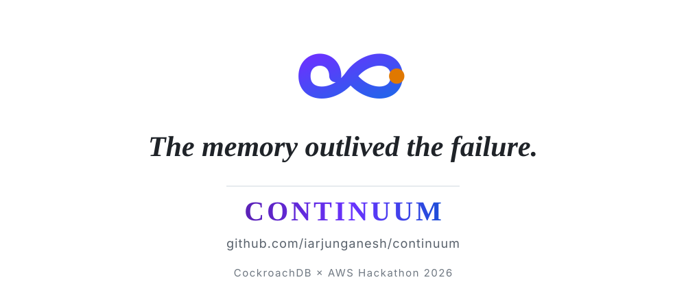

# Continuum

<p align="center">
  <picture>
    <source media="(prefers-color-scheme: dark)" srcset="assets/demo-cards/banner-dark.svg">
    <source media="(prefers-color-scheme: light)" srcset="assets/demo-cards/banner-light.svg">
    <!-- ⬇ banner size — change this one width -->
    
  </picture>
</p>

<p align="center">
  <strong>An autonomous incident-response agent that resumes the exact step it was killed on — because its memory lives in CockroachDB, not in the process.</strong>
</p>

> **CockroachDB × AWS Hackathon 2026 — Build with Agentic Memory**

[](https://github.com/iarjunganesh/continuum/actions/workflows/ci.yml)
[](https://codecov.io/gh/iarjunganesh/continuum)
[](https://github.com/iarjunganesh/continuum/releases/latest)
[](LICENSE)


<!-- Row 2 — AWS services -->
[](https://aws.amazon.com/lambda/)
[](https://aws.amazon.com/bedrock/)
[](https://aws.amazon.com/bedrock/)
[](https://aws.amazon.com/serverless/sam/)
[](https://aws.amazon.com/iam/)

<!-- Row 3 — CockroachDB -->
[](https://www.cockroachlabs.com/docs/cockroachcloud/)
[](https://www.cockroachlabs.com/docs/stable/vector-indexes)
[](https://www.cockroachlabs.com/docs/stable/cockroachdb-and-ai)
[](https://www.cockroachlabs.com/docs/stable/demo-serializable)

<!-- Row 4 — Python stack -->
[](https://www.python.org/)
[](https://fastapi.tiangolo.com/)
[](https://www.psycopg.org/psycopg3/)
[](https://pydantic.dev/)
[](https://www.structlog.org/)
[](https://docs.astral.sh/ruff/)
[](https://mypy-lang.org/)
[](https://docs.pytest.org/)

<!-- Row 5 — Demo UI -->
[](https://gradio.app/)
[](https://huggingface.co/spaces)
[](notebooks/DEMO_RUNBOOK.ipynb)

<!-- Row 6 — Hosting (live deployment) -->
[](https://huggingface.co/spaces/iarjunganesh/continuum)

---

## What Is This?

Most "agent memory" demos store chat history. Continuum stores something that matters under pressure: **which remediation step is executing right now, which alert correlates with which past incident, and the exact state of recovery the instant before something crashes.**

Every state transition is committed to **CockroachDB** before and after it happens. Kill the process mid-step — no graceful shutdown, no checkpoint call — and the next cold invocation reads the durable state, sees a step frozen in `executing`, and resumes *that exact step*. No lost context, no duplicated work, no human re-input.

**All incident and alert data is synthetic.** No real production systems, credentials, or customer data.

---

## The Problem

The conditions that cause production incidents — resource exhaustion, node failure, deploy rollbacks, autoscaling churn — are exactly the conditions that kill the agent responding to them. An agent holding its working state in process memory doesn't degrade gracefully when that happens. It stops, and a human restarts the incident from zero, without knowing which actions already ran.

That makes "did this step already execute?" the most expensive question in an incident: re-running a remediation action can be worse than not running it at all.

> **The agent's execution environment is allowed to die mid-incident. Its memory is not.**

Continuum treats that as a design constraint rather than an edge case. The recovery path is not error handling bolted onto a happy path — it is the *only* path, exercised on every single invocation.

---

## How It Works

1. A **synthetic alert** fires (latency spike, error-rate breach, connection saturation)
2. The **Orchestrator** (AWS Lambda) starts cold — its *first action, always*, is a CockroachDB recovery read for open incident state matching this alert
3. The **Correlation Agent** embeds the alert via **Amazon Bedrock** (Titan v2, 1024-dim) and queries CockroachDB's **C-SPANN vector index** for semantically similar past incidents — structured filters and semantic ranking in one SQL round trip
4. The **Remediation Agent** reasons over the matched precedent (Claude on Bedrock) and proposes the next step
5. The **Memory Agent** — the *only* module allowed to write state — commits each step in explicit `SERIALIZABLE` transactions: the proposed action and `executing` status together (a forward step is claimed exactly once, `ON CONFLICT DO NOTHING`), then `executed`, with `resolved` committed atomically alongside the final step
6. **`chaos_kill.py`** hard-kills the process mid-execution; the step stays durably `executing` in CockroachDB — the fingerprint the next invocation resumes from
7. The **Query Agent** answers live questions through the **CockroachDB Cloud Managed MCP Server** — *"show me all open incidents and their current remediation step"* — from `GET /api/v1/incidents/open` and the Gradio UI's "Ask via MCP" button, not just from a human typing into an IDE

---

## Architecture

<p align="center">
  <a href="assets/architecture/architecture-diagram-light.svg" target="_blank" rel="noopener noreferrer">
    <picture>
      <source media="(prefers-color-scheme: dark)" srcset="assets/architecture/architecture-diagram-dark.svg">
      <source media="(prefers-color-scheme: light)" srcset="assets/architecture/architecture-diagram-light.svg">
      
    </picture>
  </a>
</p>

<sub>Click to enlarge (opens the full-resolution SVG — scales without pixelation): <a href="assets/architecture/architecture-diagram-light.svg" target="_blank" rel="noopener noreferrer">light</a> / <a href="assets/architecture/architecture-diagram-dark.svg" target="_blank" rel="noopener noreferrer">dark</a> · Source: <a href="assets/architecture/architecture-diagram.mmd">architecture-diagram.mmd</a> — rendered to brand-themed SVG/PNG (dark + light, plus 16:9 video cards) via <code>mermaid-cli</code>; see <a href="assets/architecture/README.md">assets/architecture/README.md</a> for the regenerate command.</sub>

**In short:** one invocation = one remediation step. The recovery read happens *before* any reasoning, every step commits in **two** `SERIALIZABLE` transactions with the execution window between them, and a forward step is claimed exactly once. The red path is the whole point — `chaos_kill.py` severs the process mid-step, and nothing about the recovery depends on that process ever coming back.

### The Recovery Pipeline

The component diagram shows *what* talks to what. This shows *what survives* — two cold Lambda invocations, no shared memory between them, handing off entirely through durable CockroachDB state:

<p align="center">
  <a href="assets/architecture/recovery-sequence-light.svg" target="_blank" rel="noopener noreferrer">
    <picture>
      <source media="(prefers-color-scheme: dark)" srcset="assets/architecture/recovery-sequence-dark.svg">
      <source media="(prefers-color-scheme: light)" srcset="assets/architecture/recovery-sequence-light.svg">
      
    </picture>
  </a>
</p>

<sub>Click to enlarge: <a href="assets/architecture/recovery-sequence-light.svg" target="_blank" rel="noopener noreferrer">light</a> / <a href="assets/architecture/recovery-sequence-dark.svg" target="_blank" rel="noopener noreferrer">dark</a> · Source: <a href="assets/architecture/recovery-sequence.mmd">recovery-sequence.mmd</a></sub>

**Step 2 is the one that matters.** The recovery read is the *first* branch in `orchestrator.py`, before any new reasoning happens — not an error handler, not a retry wrapper. That is what separates Continuum from an agent that also happens to log to a database.

> **Deep dive** → **[`docs/ARCHITECTURE.md`](docs/ARCHITECTURE.md)** — the dual memory model, the step-by-step recovery walkthrough, the vector-index DDL, and a typical-agent vs Continuum comparison.

### Architecture Decision Records

Nine decisions documented (001–009), **all accepted and implemented** — see [`docs/adr/`](docs/adr/) for full rationale.

| ADR | Decision |
| --- | --- |
| [001](docs/adr/001-dual-memory-model.md) | Dual transactional + vector memory in one CockroachDB store — no separate vector DB to drift |
| [002](docs/adr/002-stateless-lambda-recovery.md) | Stateless Lambda, no provisioned concurrency — every invocation must recover cold |
| [003](docs/adr/003-mcp-readonly-queries.md) | MCP Server in read-only mode as the live query interface |
| [004](docs/adr/004-ccloud-cli-audit-role.md) | ccloud CLI evaluated, then cut — 2 tools done well beats 3 done thin |
| [005](docs/adr/005-synthetic-incident-data.md) | Synthetic incident corpus only — no real infra, ever |
| [006](docs/adr/006-scope-cuts.md) | Explicit scope cuts, documented instead of hidden |
| [007](docs/adr/007-eu-central-1-region.md) | eu-central-1 deployment region, kept in sync across config/template/ADR |
| [008](docs/adr/008-bedrock-region-split.md) | Bedrock calls target their own `BEDROCK_REGION` setting rather than reusing `AWS_REGION`, so Bedrock can move without redeploying the Lambda — introduced when a dynamic account-level quota clamp probed as ~0 across all regions and models (lifted 2026-08-01); the default is back to eu-central-1 alongside the Lambda and cluster (addendum 3), and the app degrades to deterministic fallbacks either way |
| [009](docs/adr/009-step-execution-semantics.md) | Each step runs in two explicit `SERIALIZABLE` transactions with a forward-step claim (`ON CONFLICT DO NOTHING`) for exactly-once; correlation/Bedrock is best-effort, off the recovery critical path |

---

## CockroachDB Tools Used — and what the agent actually does with them

Two tools, both load-bearing in the running application (see ADR 004's resolution on why that's two done well rather than three done thin):

- **Distributed Vector Indexing** — `incident_embeddings.embedding VECTOR(1024)` with a C-SPANN index prefixed by `service`, so ANN search partitions per-service. The Correlation Agent's live query filters by structured columns *and* ranks by `<->` distance in one round trip. See [`infra/schema.sql`](infra/schema.sql).
- **CockroachDB Cloud Managed MCP Server** — read-only mode; `agents/query_agent.py` is a real MCP client (official `mcp` SDK, streamable HTTP) that the app itself calls from `GET /api/v1/incidents/open` and the Gradio UI's "Ask via MCP" button — not only a development convenience. The server's audit log doubles as a trail of what the agent looked at.

## AWS Services Used

- **AWS Lambda** — orchestrator execution on the `python3.14` runtime; deliberately **no provisioned concurrency**, so every invocation proves state comes from CockroachDB, not warm process memory (ADR 002)
- **Amazon Bedrock** — Titan Text Embeddings V2 for alert→vector; Claude Sonnet 4.5 for remediation reasoning over matched precedent (with a deterministic precedent-replay fallback so the control flow demos even when throttled)
- **AWS SAM** — infrastructure as code ([`infra/template.yaml`](infra/template.yaml)); the *absence* of `ProvisionedConcurrencyConfig` is a reviewable artifact rather than a console setting
- **AWS IAM** — least privilege: application credentials are scoped to Bedrock model invocation only and cannot list, create, or delete AWS resources

Judging-criteria mapping and full submission narrative: [`submission/DEVPOST.md`](submission/DEVPOST.md)

---

## Tech Stack

| Layer | Technology | Role |
| --- | --- | --- |
| **Memory** | [](https://www.cockroachlabs.com/docs/cockroachcloud/) | The durable record. Transactional incident state *and* vector embeddings in one store — no second database to drift (ADR 001) |
| **Durability** | [](https://www.cockroachlabs.com/docs/stable/demo-serializable) | Two explicit transactions per step — `executing` committed *before* the execution window, `executed` after. A kill lands with `executing` durable (ADR 009) |
| **Correlation** | [](https://www.cockroachlabs.com/docs/stable/vector-indexes) | `service`-prefixed C-SPANN index; structured filter + `<->` ANN ranking in one round trip ([`infra/schema.sql`](infra/schema.sql)) |
| **Live Queries** | [](https://www.cockroachlabs.com/docs/stable/cockroachdb-and-ai) | The app itself is the MCP client, not just a developer's IDE — `GET /api/v1/incidents/open` and the UI's "Ask via MCP" (ADR 003) |
| **Agent Pattern** | [](agents/orchestrator.py) | Orchestrator · Correlation · Remediation · Memory · Query. `memory_agent.py` is the *only* module permitted to write state |
| **Embeddings** | [](https://aws.amazon.com/bedrock/) | Alert → 1024-dim vector, matching the `VECTOR(1024)` schema |
| **Reasoning** | [](https://aws.amazon.com/bedrock/) | Next-step proposal over matched precedent, with deterministic precedent-replay fallback so the flow demos even when throttled |
| **Compute** | [](https://aws.amazon.com/lambda/) | Stateless orchestrator, deliberately **no provisioned concurrency** — every invocation proves cold recovery (ADR 002, [`infra/template.yaml`](infra/template.yaml)) |
| **Backend** | [](https://www.python.org/) [](https://fastapi.tiangolo.com/) [](https://www.psycopg.org/psycopg3/) | Versioned gateway (`/api/v1`) around the orchestrator; psycopg 3 because psycopg2 has no 3.14 wheels |
| **Demo UI** | [](https://gradio.app/) [](https://huggingface.co/spaces/iarjunganesh/continuum) | Live incident console with recovery-timeline replay, reading straight from CockroachDB |
| **Observability** | [](https://www.structlog.org/) | Structured event logging across every agent — no bare `print` |
| **Quality** | [](https://docs.astral.sh/ruff/) [](https://mypy-lang.org/) [](https://docs.pytest.org/) | Lint → format → types → 53 unit + 5 integration tests → 100% coverage against a 90% gate → Codecov |

---

## Live Demo

| | |
| --- | --- |
| **App** | [https://huggingface.co/spaces/iarjunganesh/continuum](https://huggingface.co/spaces/iarjunganesh/continuum) *(deploys on push to `main`)* |
| **Orchestrator** | Live on AWS Lambda — `continuum-orchestrator`, eu-central-1 (stack `continuum`, deployed via SAM). No provisioned concurrency, so every invocation is a genuine cold start: **1.71 s init, 129 MB / 512 MB** |
| **Demo Video** | *Not yet recorded.* Recording script: [`submission/DEMO_SCRIPT.md`](submission/DEMO_SCRIPT.md) |
| **Try It Now** | `make chaos-demo` — kill the agent mid-incident, watch it resume from CockroachDB |

Submission checklist: [`submission/SUBMISSION.md`](submission/SUBMISSION.md) · Judging alignment + project story: [`submission/DEVPOST.md`](submission/DEVPOST.md) · Cost model: [`submission/COSTS.md`](submission/COSTS.md)

### Run it yourself — the interactive notebook

[](notebooks/DEMO_RUNBOOK.ipynb)

**[`notebooks/DEMO_RUNBOOK.ipynb`](notebooks/DEMO_RUNBOOK.ipynb)** — a self-contained walkthrough of the kill-and-recover sequence. The recovery guarantee is easy to assert and hard to believe without watching it, so step through it yourself rather than taking the README's word.

| Section | Needs a local API? | What you'll see |
| --- | --- | --- |
| **1 — Fire a synthetic alert** | No | Recovery read runs *before* any reasoning; correlation finds a precedent |
| **2 — Read state back over MCP** | No | The app calling the Managed MCP Server's read-only SQL tool, live (ADR 003) |
| **3 — Advance one step** | No | Two `SERIALIZABLE` commits per step with the execution window between them |
| **4 — The kill** | **Yes** | A real `SIGKILL` landing mid-step — no graceful shutdown, no checkpoint call |
| **5 — State outlived the process** | **Yes** | The row sitting in `executing` with nothing alive to own it — *the whole thesis* |
| **6 — The recovery** | **Yes** | That exact step re-executed, not skipped and not duplicated |

```bash
pip install -r requirements.txt jupyter
make run-api                      # in a separate terminal
jupyter lab notebooks/DEMO_RUNBOOK.ipynb
```

Setup notes and conventions: [`notebooks/README.md`](notebooks/README.md).

---

## Screenshots

Judge-facing evidence — captured kill-and-recover runs with raw DB snapshots, structured logs, and numbered screenshots — lives in [`assets/README.md`](assets/README.md), which indexes what each run proves.

> **Not yet captured.** The runs are recorded against the deployed Lambda so the evidence shows the real system rather than a local-only one; [`assets/README.md`](assets/README.md) carries the capture plan and the numbered shot list in the meantime. This section will list actual images.

---

## Quick Start

```bash
# 1. Clone
git clone https://github.com/iarjunganesh/continuum.git
cd continuum

# 2. Configure (CockroachDB Cloud free tier + AWS credentials)
cp .env.example .env    # fill in COCKROACH_DATABASE_URL + AWS keys

# 3. Install (requires Python 3.14)
make install

# 4. Apply schema + seed synthetic incident history (with embeddings)
make migrate
make seed-data

# 5. Run the API + demo UI
make run-api
make run-ui

# 6. The resilience demo — kills the agent mid-step, proves recovery
make chaos-demo
```

On Windows (no `make`), use the PowerShell equivalents:

```powershell
.\scripts\migrate_and_seed.ps1   # step 4 — schema + synthetic seed data
.\scripts\chaos_demo.ps1         # step 6 — the resilience demo
```

The API is versioned under `/api/v1` — e.g. `GET /api/v1/health`, `POST /api/v1/alert` — so the wire contract can evolve without breaking the Gradio UI or demo scripts.

---

## Synthetic Demo Data

40 resolved historical incidents across 5 fictional services (`checkout-api`, `auth-service`, `recommendation-engine`, `search-index`, `billing-worker`), each seeded with its **actual remediation path** (e.g. `drain_connection_pool → restart_connection_pool → verify_connections_healthy`) — so when a live alert correlates with a precedent, the Remediation Agent has real steps to replay, not just a summary. Regenerate anytime:

```bash
python scripts/generate_synthetic_incidents.py --out data/synthetic/incidents_seed.jsonl --count 40
```

**Seeding without Bedrock.** `make seed-data` embeds each incident via Titan. To populate the console or Space with **no AWS dependency at all**, use deterministic vectors — `make seed-data-offline` (or `.\scripts\migrate_and_seed.ps1 -Offline`). For honest, semantically-ranked vectors without a per-run Bedrock call, capture them once where Bedrock is reachable (`python scripts/capture_seed_embeddings.py`) and seed with `python scripts/seed_memory.py --file … --from-fixture data/synthetic/seed_embeddings.json`.

---

## Project Structure

```text
continuum/
├── agents/
│   ├── orchestrator.py        # Lambda entrypoint — recovery read FIRST, one step per invocation
│   ├── correlation_agent.py   # Bedrock Titan embeddings + CockroachDB vector search
│   ├── memory_agent.py        # THE single write path to incidents/remediation_steps
│   ├── remediation_agent.py   # Claude-on-Bedrock reasoning + precedent-replay fallback
│   └── query_agent.py         # CockroachDB Managed MCP Server client (read-only live queries)
├── api/main.py                # FastAPI gateway, versioned under /api/v1
├── infra/
│   ├── schema.sql             # incidents · remediation_steps · incident_embeddings VECTOR(1024)
│   ├── lambda_handler.py      # Lambda package entrypoint
│   └── template.yaml          # AWS SAM — deliberately NO provisioned concurrency (ADR 002)
├── scripts/
│   ├── generate_synthetic_incidents.py   # corpus incl. historical remediation paths
│   ├── seed_memory.py         # loads incidents + step history + embeddings
│   ├── chaos_kill.py          # cross-platform hard kill (psutil) — the demo beat
│   ├── chaos_demo.ps1         # Windows kill-and-recover sequence
│   ├── demo_run.py            # drives one remediation step per --tick
│   └── build_devpost_readme.py   # regenerates the Devpost paste mirror from README.md
├── ui/app.py                  # Gradio — live incident console + recovery-timeline replay
├── prompts/
│   └── remediation_agent.txt  # Claude reasoning prompt — data, not code (loaded at import)
├── tests/
│   ├── unit/                  # recovery-semantics tests (all I/O mocked)
│   ├── integration/           # full kill-and-recover cycle vs a real cluster
│   └── load/k6_smoke.js       # read-path smoke load (health + MCP-backed /incidents/open)
├── observability/structured_logger.py
├── docs/
│   ├── ARCHITECTURE.md · DEPLOY.md · BENCHMARKS.md · RESILIENCE.md
│   └── adr/                   # 9 Architecture Decision Records
├── submission/                # judge-facing packet
│   └── SUBMISSION.md · DEVPOST.md · DEVPOST_README.md · DEMO_SCRIPT.md · COSTS.md
├── assets/                    # judge-facing evidence — see assets/README.md
│   ├── architecture/          # mermaid source + brand-themed SVG/PNG renders
│   ├── chaos-run/             # captured kill-and-recover runs (evidence/ + screenshots/)
│   ├── demo-cards/            # banner + sign-off cards (SVG source, 16:9 video PNGs)
│   ├── demo-video/            # final cut, captions, per-beat takes
│   └── logo.svg
├── notebooks/DEMO_RUNBOOK.ipynb   # run the recovery demo against a live cluster, no local setup
└── .github/workflows/         # ci.yml · release.yml · sync-to-hf-space.yml
```

---

## Production & Quality

```text
push → ruff lint → ruff format --check → mypy → Devpost mirror freshness
     → ephemeral single-node CockroachDB → schema apply
     → pytest (53 unit + 5 integration) → coverage (≥90% gate, 100% measured) → Codecov
push to main → auto-sync to Hugging Face Space (public demo)
tag v*.*.*   → GitHub Release, notes pulled from CHANGELOG.md
```

See [`.github/workflows/ci.yml`](.github/workflows/ci.yml), [`.github/workflows/release.yml`](.github/workflows/release.yml), and [`docs/DEPLOY.md`](docs/DEPLOY.md).

The unit suite (53 tests, one file per agent/module, 100% measured coverage against a 90% CI gate) pins the properties the demo depends on: recovery read happens before any write, each step commits inside an explicit `SERIALIZABLE` transaction, interrupted steps are re-executed (never skipped, never duplicated), a forward step is claimed exactly once under concurrent invocations, and incidents resolve atomically with the final step.

[`tests/integration/test_recovery_e2e.py`](tests/integration/test_recovery_e2e.py) drives that same resume-and-exactly-once contract against the real schema on a real CockroachDB instance CI spins up — not just against mocks — and [`tests/integration/test_chaos_kill_e2e.py`](tests/integration/test_chaos_kill_e2e.py) goes one step further: it spawns the orchestrator as a real subprocess and hard-kills it mid-step with [`scripts/chaos_kill.py`](scripts/chaos_kill.py) (a real `SIGKILL`/`TerminateProcess`, no graceful shutdown), then asserts a cold restart resumes the interrupted step exactly once from CockroachDB. The same script drives the literal process-kill beat live in the demo.

Beyond tests: structlog JSON logging across every agent, secrets via environment only, least-privilege IAM, and documented scope cuts (ADR 006) rather than hidden ones. Security posture and known limitations: [`SECURITY.md`](SECURITY.md). Cost model and guardrails: [`submission/COSTS.md`](submission/COSTS.md).

### Load & Resilience

What a remediation step actually costs, end to end: the CockroachDB legs (recovery read, both transaction commits, C-SPANN vector search, the full cold-resume path), the Bedrock legs (real Titan embedding), and the same work measured **on the deployed Lambda** rather than predicted from a workstation. Every run records which path actually executed — `correlation_source` / `reasoning_source` are counted, not assumed, so a throttled account can't quietly publish cheaper numbers under a Bedrock headline. `make benchmark` (add `--with-bedrock --lambda-n N` for the AWS legs; the default run needs no AWS). Full tables, methodology and caveats: [`docs/BENCHMARKS.md`](docs/BENCHMARKS.md).

Speed is the less interesting half. The claim this project exists to make is about **correctness when things go badly**, so that is measured too — every number below counted from durable CockroachDB rows rather than from a log, against the live cluster and the deployed function. `make resilience-bench`; full method, sample sizes and caveats in [`docs/RESILIENCE.md`](docs/RESILIENCE.md), raw evidence under [`assets/resilience-run/`](assets/resilience-run/).

| Failure mode | Result |
| --- | --- |
| Kill storm — 50 incidents interrupted mid-step | **50 resumed · 0 duplicated · 0 lost** |
| Real `SIGKILL` against a live process | 10 kills · **10 resumed · 0 duplicated** |
| **AWS Lambda timeout — AWS does the killing** | 15 invocations · **15 killed by AWS · 15 resumed exactly once** |
| Exactly-once under concurrent claimants | 100 trials, 5 levels up to 50-way · **0 violations** |
| Concurrent agents | 10 / 50 / 100 · 55.7 completed/s · **0 failures** |
| C-SPANN vector search, 100 → 10,000 vectors | 44 → 107 ms vs full scan 58 → 650 ms — **6.1× faster** |

The Lambda-timeout row is the one that can't be argued with: the process isn't killed by our own script but by **AWS terminating the function**, with no signal the runtime can catch and no opportunity to checkpoint. Every one of those recovered exactly once.

[`tests/load/k6_smoke.js`](tests/load/k6_smoke.js) ramps concurrent users against `/api/v1/health` and the MCP-backed `/api/v1/incidents/open`, so the measurement covers the live MCP round trip rather than just FastAPI. It deliberately does **not** hammer `POST /alert`: that drives real state through the single write path, and exercising the forward-step claim outside controlled conditions would fabricate incidents rather than test them — exactly-once is proven in the integration suite instead.

```bash
winget install k6   # or: brew install k6
make load-test                                        # local API
k6 run -e BASE_URL=https://<host> tests/load/k6_smoke.js   # deployed
```

---

## Roadmap (Post-Hackathon)

- Real alert-source integrations (PagerDuty/Opsgenie webhook ingestion) in place of the synthetic stream
- Multi-region incident correlation via `REGIONAL BY ROW` incident tables
- Contradiction/drift detection across recurring incident patterns
- Slack/Teams remediation-approval loop before a proposed step executes

---

## Disclosure & Disclaimer

Built solo during the Submission Period (June 30 – August 18, 2026) with **Claude Code** as an AI coding assistant, per the hackathon's disclosure requirement. No pre-existing code was incorporated. All incident, alert, and remediation data is synthetic; Continuum is a technology demonstration, not a production incident-management tool, and is not affiliated with any company's real infrastructure.

> *Built by [Arjun Ganesh](https://github.com/iarjunganesh) for the [CockroachDB × AWS Hackathon 2026](https://cockroachdb-ai.devpost.com/).*

<p align="center">
  <picture>
    <source media="(prefers-color-scheme: dark)" srcset="assets/demo-cards/signoff-dark.svg">
    <source media="(prefers-color-scheme: light)" srcset="assets/demo-cards/signoff-light.svg">
    
  </picture>
</p>
